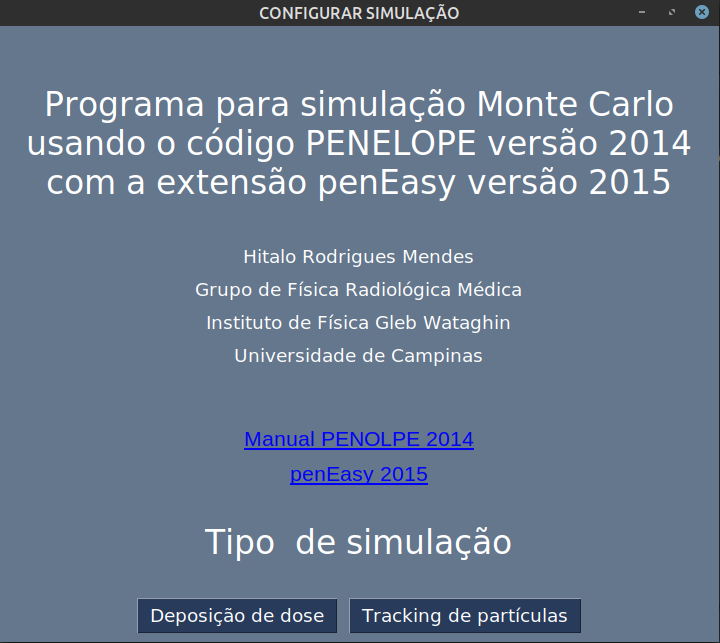
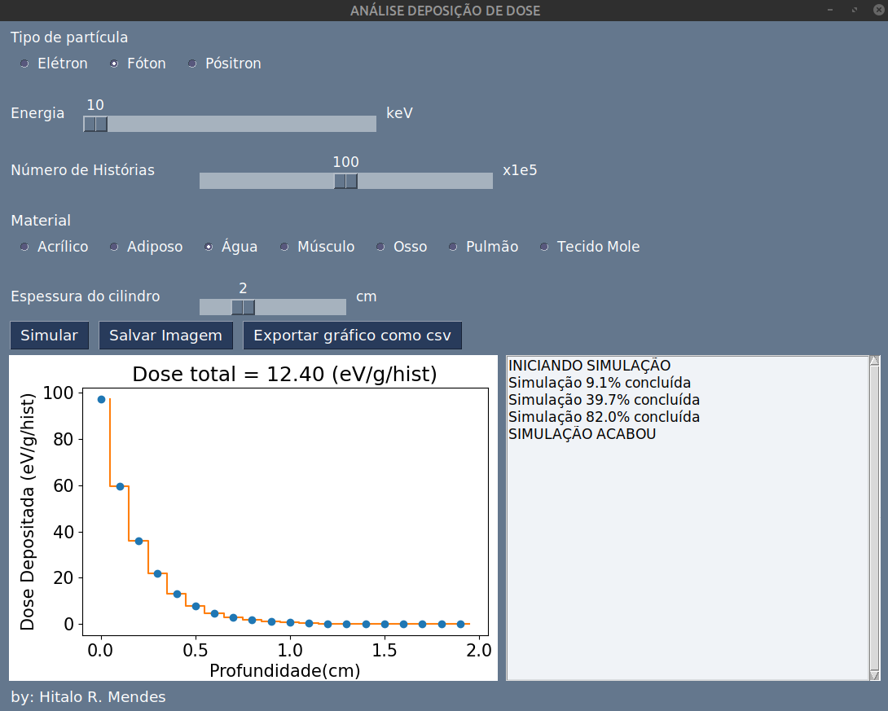

# Interface grafica PENELOPE

Este programa é uma interface gráfica para realizar simulações Monte Carlo focado no ensino de Física das Radiações.
As simulações são realizadas usando um código PENELOPE versão 2014 com a extensão penEasy versão 2015.

Uma explicação detalhada do programa e seu funcionamento está presente no artigo: "pyPEN: uma interface gráfica user-friendly para simulação Monte Carlo em física médica"

https://www.scielo.br/j/rbef/a/w33R7jZWq6YML46x63frHKj/?lang=pt

A Figura abaixo mostra a interface gráfica ao ser iniciada.

  

Nesta tela estão links para o Manual do PENELOPE 2014 [1] e também do penEasy 2015 [2]. É possível escolher dois tipos de simulação: "Deposição de dose" e "Tracking de partículas".

## 1. Deposição de dose
A Figura abaixo mostra a tela da interface no modo "Deposição de Dose".

  

Com o uso da interface gráfica é possível selecionar o tipo de partícula a ser simulada (elétron, fóton ou pósitron) e o número de partículas iniciais (número de histórias). A geometria de simulação consiste de uma caixa com área de 10x10 cm² e espessura variando de 1 a 5 cm. A caixa é homogênea e usando a interface gráfica é possível selecionar o material que a comp~oe. A Tabela 1 mostra composição atômica de cada material. Uma fonte monoenergética, cuja energia pode ser selecionada usando a interface, incide na superfície da caixa.

Uma vez selecionados os parâmetros da simulação, clique em "Simular", a mensagem "INICIANDO SIMULACÃO" irá aparecer, quando a simulação terminar aparecerá a mensagem "SIMULAÇÃO ACABOU". E imediatamente após o término da simulação aparecerá um gráfico da dose em profundidade. A dose em profundidade foi obtida subdividindo a caixa em fatias e determinando a dose depositada em cada fatia. Acima do gráfico é mostrada da dose média depositada em todo o objeto. Todas as doses estão em unidade de eV/g/história. Para salvar o gráfico no formato PNG clique em "Salvar Imagem" e para extrair os dados usados para gerar o gráfico clique em "Exportar gráfico como csv". Em ambos os casos o arquivo será salvo na pasta ***resultados***.

## Tracking de partículas

A Figura abaixo mostra a tela da interface no modo "Tracking de Partículas".

Com o uso da interface gráfica é possível selecionar o tipo de partícula a ser simulada (elétron, fóton ou pósitron) e o número de partícula iniciais (número de histórias). A geometria de simulação é similar ao caso de "Deposição de Dose" com as diferenças sendo a espessura da caixa, agora variando de 1 a 10 mm. Além disso, os materiais possíveis para este caso são elementos puros, sendo possível alterar a sua densidade de 1 a 20 g/cm³.

Uma vez selecionados os par^ametros da simulação, clique em "Simular" a mensagem "INICIANDO SIMULAÇÃO" irá aparecer, quando a simulação terminar aparecerá a mensagem "SIMULAÇÂO ACABOU". E imediatamente após o término da simulação aparecerão três gráficos mostrando a trajetória dos elétrons, fótons ou pósitrons nas simulações. Para salvar os gráfcios no formato PNG clique em "Salvar Imagem".

## 3 INFORMAÇÕES IMPORTANTES AO RODAR AS SIMULAÇÕES

ˆ Para esta interface funcionar corretamente deve estar sempre acompanhada da pasta ***run***;
ˆ Não altere nenhum arquivo da pasta **run**;
ˆ Quanto maior o número de histórias mais longa será a simulação;
ˆ Simular elétrons e pósitrons é mais demorado do que simular fótons, portanto, leve isso em conta
ao selecionar o número de histórias.

**ReferÊncias**

1. Salvat, F., Fernández-Varea, J. M. & Sempau, J. PENELOPE-2014: A code system for Monte Carlo simulation of electron and photon transport em the Workshop Proceedings, June (2014).
2. Badal Soler, A. Development of advanced geometric models and acceleration techniques for Monte Carlo simulation in Medical Physics (Universitat Politècnica de Catalunya, 2008).
3. Berger, M. et al. XCOM: Photon cross sections on a personal computer rel. técn. (National Bureau of Standards, Washington, DC (USA). Center for Radiation Research, 2010).
O executável para Windows: https://drive.google.com/file/d/1YUrdKLbMRGNZhF5aVkr7je4U2rcBuPcR/view?usp=sharing
